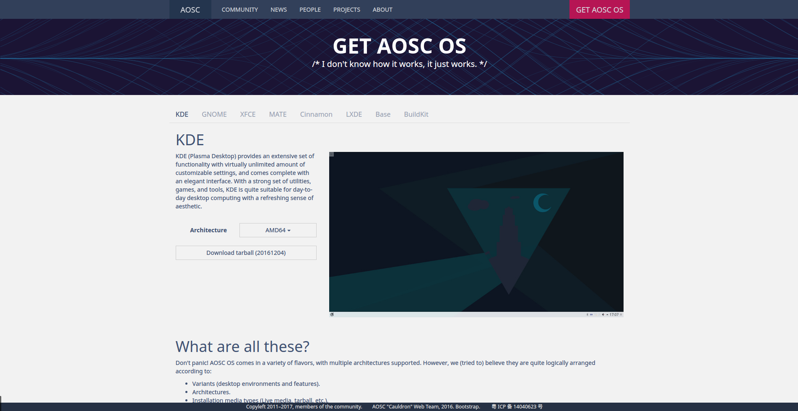

### 下载 tarball

AOSC OS 现阶段还没有一个新手友好的安装器，仅仅发行 tarball，而 tarball 是**不能**直接运行的。\(这也是本指南存在的原因之一\)

#### 什么是 tarball？

AOSC 的 tarball 为使用 `GNUtar` 打包并以 `xz` 格式压缩后的系统文件。

文件拓展名为 `.tar.xz`

而 `tar` 是 UNIX/UNIX-Like 系统里的一个打包程序，它的行为类似于我们（曾经也许）常用的 WinRAR 等等，但是 `tar` 仅仅会对文件进行打包，并不会对文件进行压缩。

所以我们亲爱的 `tarball` 实际上是这样的情况：

```
┌───────  以 xz 格式进行压缩 ────────┐
│ ┌────── tar 对文件进行打包───────┐ │
│ │ ┌──────────────────────────┐ │ │
│ │ │ [/etc,/usr 等等的系统文件] │ │ │
│ │ └──────────────────────────┘ │ │
│ └──────────────────────────────┘ │ 
└──────────────────────────────────┘
```

#### 那我们要怎么安装焦油球呢？

先别急，我们先去门户网站下载焦油球。

打开 [https://aosc.io/](https://aosc.io/) ，在右上角有个巨大的 `GET AOSC OS`。

  
然后我们可以看到有很多选项。  


首先是焦油球们的类型。

AOSC 的焦油球们分为 KDE, GNOME, XFce, Mate, Cinnamon, LXDE, Base, BuildKit 八个版本。

* KDE, GNOME, XFce, Mate, Cinnamon, LXDE 是以用的 DE \(Desktop Environment 桌面环境\)区分的，具体就不多说了，看个人喜好吧 ：）

* Base 版与上面这些版本~~（妖艳贱货）~~的区别是它不自带 DE，如果选择 `Kernel-less` 的话还少个内核（但你仍然可以使用包管理安装上 DE，内核等等）。

* BuildKit 类似于 Base，但它不带内核，并且自带构建工具和 ABBS/ACBS 以及 ABBS 树（这部分内容在以后会讲）。是用来给 AOSC OS 打包软件的（`chroot` 方式和 `systemd-nspawn` 方式）

其次是 Architecture（架构），这个就需要根据你要安装 AOSC OS 的设备来选择了（如果下载错，将会无法运行）。

* **AMD64**： 提供给 AMD64 架构的系统使用。AMD64 是现在**绝大多数**个人电脑（PC）所使用的架构。即使你用 Intel 处理器也应该选这个。本文之后也仅仅讨论此架构。
* **ARMv7**： 提供给使用 Cortex-A5, Cortex-A7, Cortex-A8, Cortex-A9 等等的 ARMv7 架构的系统。
* **ARMv8**： 提供给使用 Cortex-A32, Cortex-A53, Cortex-A57, Cortex-A72 等等的 ARMv8 架构的系统。
* **MIPS32**： 提供给 MIPS 32 架构的系统（主要为龙芯/Loongson）。
* **PowerPC 32-Bit \(BE\)**：提供给使用 PPC32 **大端序（Big-Endian）**架构的系统使用。
* **PowerPC 64-Bit \(BE\)**：提供给使用 PPC64 **大端序（Big-Endian）**架构的系统使用。
* MIPS64 的移植还在进行中（Update 2017-02-26：MIPS64el 移植已经完成了 Base 级别的构建，详情见新浪微博 [@安同开源](http://weibo.com/anthondev) ）
* 有对 RISC-V 架构移植的计划，不过自然是要等有 RISC-V 架构的机器上市。

**注意： ARM 架构的由于它们的特殊情况，还需要选择设备的 SoC 厂商及具体型号。**  
**注意： ARM 架构的由于它们的特殊情况，下载下来的是 SD 卡镜像，直接写入启动设备即可。**  
**注意： 如果你不知道你的电脑是什么架构的，那就选 AMD64 吧**

#### 接下来就是下载了，用你自己喜欢的下载器下载吧。


